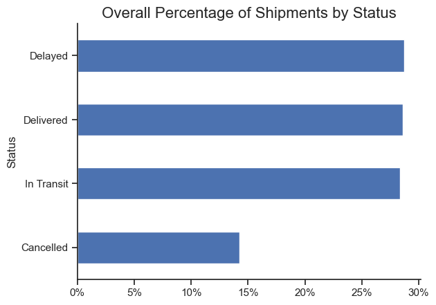
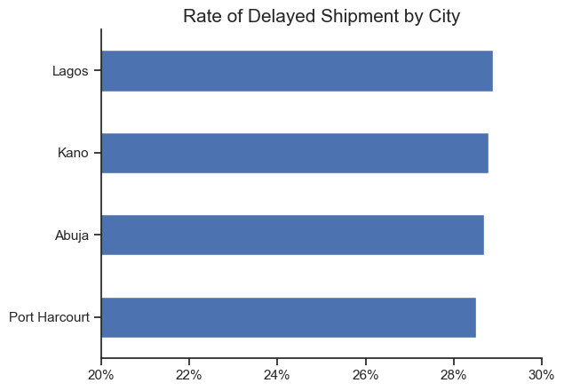
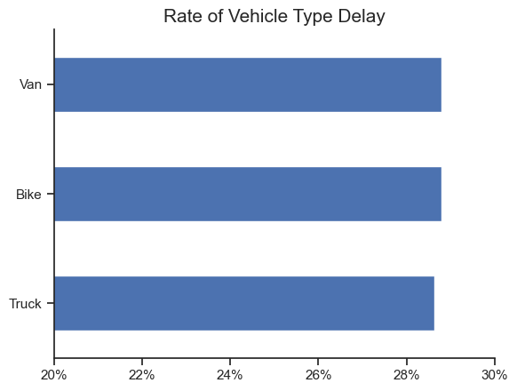
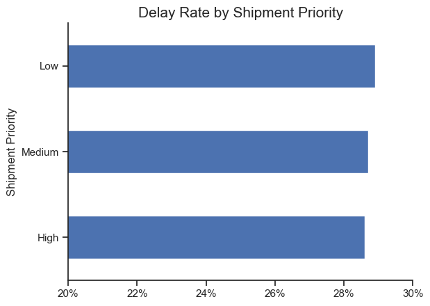
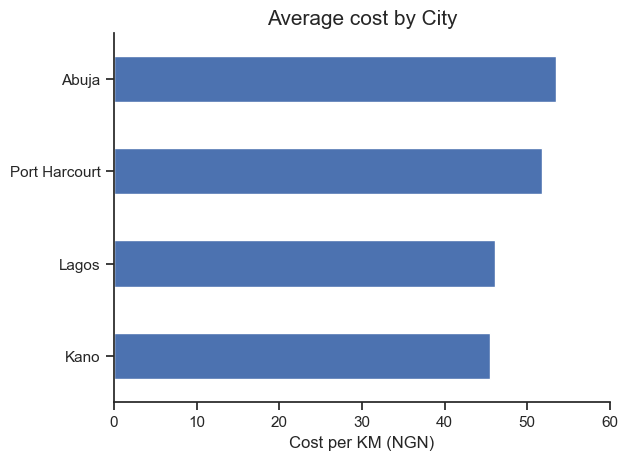
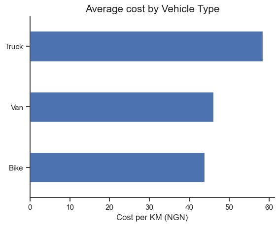
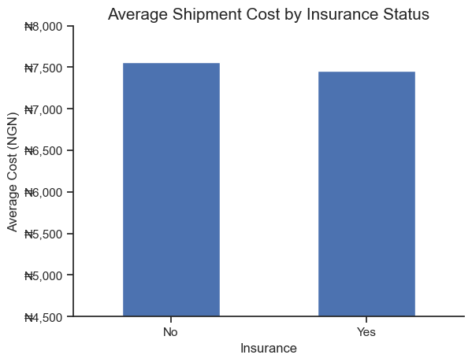
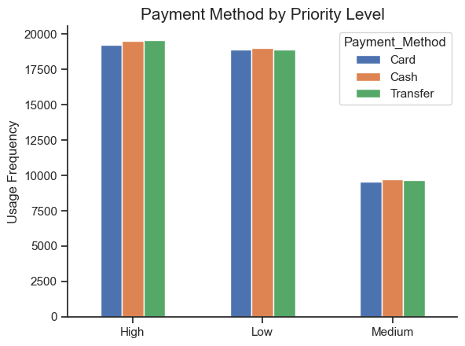

# Nigeria Logistics Shipment Analysis

A data analysis project covering the full lifecycle of a messy, real-world logistics dataset, from raw dirty data through systematic cleaning to exploratory analysis, using Python.

---

## Business Question

> _What does shipment performance look like across Nigeria's major cities, and where are the biggest operational inefficiencies in cost, delivery, and vehicle utilisation?_

---

## Dataset

| Property  | Raw Dataset                       | Cleaned Dataset                   |
| --------- | --------------------------------- | --------------------------------- |
| Records   | 150,500 rows                      | 144,036 rows                      |
| Columns   | 20                                | 28                                |
| Rows Lost | —                                 | 6,464 (4.3%)                      |
| Period    | Jan 2022 – Dec 2025               | Jan 2022 – Dec 2025               |
| Cities    | Lagos, Abuja, Kano, Port Harcourt | Lagos, Abuja, Kano, Port Harcourt |

The raw dataset contained significant data quality issues including duplicate records, invalid date formats, negative physical values, case inconsistencies, and typographical errors across multiple columns. The cleaned dataset added 8 engineered columns to support operational analysis.

---

## Data Quality Issues Found & Resolved

| Issue                | Detail                                                   | Resolution                                             |
| -------------------- | -------------------------------------------------------- | ------------------------------------------------------ |
| Duplicate rows       | 500 fully identical records                              | Dropped                                                |
| Invalid dates        | Mixed formats + impossible dates (e.g. 32-13-2023)       | Converted with `errors='coerce'`, invalid rows dropped |
| Negative values      | Negative Weight_kg, Cost_NGN, Distance_km, Delivery_Days | Replaced with column medians                           |
| Case inconsistencies | `delivered`, `Delivered`, `DELIVERED` across 6 columns   | Standardised with `.str.strip().str.title()`           |
| Typographical errors | `Delayd`, `Bke`, `Tranfer`                               | Corrected with `.replace()`                            |
| Null Shipment IDs    | 1,476 rows with no identifier                            | Assigned placeholder IDs (`SHPFILL001` etc.)           |
| Useless columns      | `Notes` (2 unique values), `Remarks` (75% nulls)         | Dropped                                                |

---

## Tools & Libraries

- **Python 3**
- **Pandas** — data profiling, cleaning, and feature engineering
- **Matplotlib** — data visualisation
- **Seaborn** — chart styling

---

## Analytical Pipeline

| Notebook                  | Stage                               | Description                                                                                                                                                                 |
| ------------------------- | ----------------------------------- | --------------------------------------------------------------------------------------------------------------------------------------------------------------------------- |
| `00_data_profiling.ipynb` | Data Profiling                      | Shape, dtypes, nulls, duplicates, date formats, value distributions, negative value audit                                                                                   |
| `01_cleaning.ipynb`       | Data Cleaning + Feature Engineering | Deduplication, column drops, ID imputation, categorical standardisation, date conversion, negative value handling, dtype correction, 9 new columns engineered before export |
| `02_eda.ipynb`            | Exploratory Data Analysis           | 4 EDA sections across delivery performance, cost efficiency, volume trends, and payment behaviour                                                                           |

---

## Feature Engineering

Nine new columns were created from existing data to power the analysis:

| Column               | Description                                   |
| -------------------- | --------------------------------------------- |
| `Shipment_Month`     | Month name extracted from Shipment_Date       |
| `Shipment_Year`      | Year extracted from Shipment_Date             |
| `Shipment_Quater`    | Q1–Q4 mapped from quarter number              |
| `Shipment_DayOfWeek` | Day name extracted from Shipment_Date         |
| `Cost_per_km`        | Cost_NGN ÷ Distance_km                        |
| `Cost_per_kg`        | Cost_NGN ÷ Weight_kg                          |
| `Is_Late`            | Boolean flag — True where Status == "Delayed" |
| `Distance_Band`      | Short / Medium / Long bins using pd.cut()     |
| `Weight_Band`        | Light / Medium / Heavy bins using pd.cut()    |

---

## Key Findings

### 1. Nearly 30% of all shipments are delayed with no city, vehicle, or priority level standing out

The overall delay rate is 28.74% and cancellation rate is 14.27%, meaning fewer than 3 in 10 shipments are delivered cleanly on time. Delay rates across all four cities, all three vehicle types, and all three priority levels cluster tightly around 28–29%. This uniformity indicates a systemic operational problem rather than a route- or fleet-specific one.

### 2. Kano is the most cost-efficient city per kilometre

Cost-per-km analysis by origin city reveals Kano as the cheapest route in the network, while Lagos carries the highest average cost per km. Across vehicle types, Bikes are the most cost-efficient per km, although their lower payload capacity limits their applicability for heavier shipments.

### 3. Insured shipments are slightly cheaper and payment methods are evenly distributed

Insured shipments cost an average of ₦7,458 versus ₦7,556 for uninsured ones; a counterintuitive finding suggesting higher-value or longer-distance shipments are not the ones being insured.
Cash, Transfer, and Card are almost equally distributed as payment methods across all priority levels, indicating no strong payment preference by customer segment.

---

## Recommendations

### Commission a systemic operational audit

Given that delay rates are uniform across every dimension analysed, targeted interventions at the city or vehicle level will not solve the problem. A full audit of dispatch scheduling, driver assignment, warehouse turnaround times, and customer communication workflows is needed to identify where in the process delays are being introduced.

---

## Limitations

### Dataset provenance is unclear

The near-uniform distribution of delay rates across all dimensions, cities, vehicle types, priority levels is characteristic of synthetically generated data rather than real operational records. Findings should be treated as directional rather than definitive.

---

## Conclusion

This project demonstrates a complete, production-style analytics workflow on a large, deliberately messy logistics dataset. Starting from 150,500 raw records with multiple categories of data quality issues, the pipeline produced a clean, analysis-ready dataset of 144,036 rows with 28 well-documented columns. The subsequent EDA surfaces a clear central finding: the delay problem in this logistics network is systemic, not localised which points directly to where management attention should be focused.

---

## Author: OJO Babatunde Samuel. A Data Analyst | Agricultural Engineering Graduate | Lagos, Nigeria

> _This project was designed as a Python-only analytics workflow. The cleaning and EDA stages were kept in separate notebooks intentionally — cleaning runs once and exports a stable CSV, which the EDA notebook consumes independently. This separation reflects standard practice in production analytics environments._
